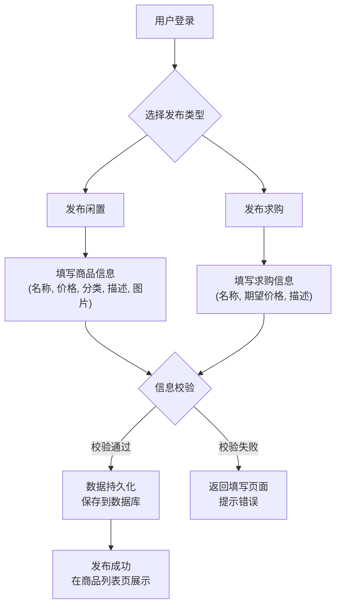

# 校园二手拍卖平台项目文档

## 1. 项目简介

### 1.1 项目背景与目标
在当今的大学校园中，学生们常常面临着一个普遍问题：随着学期的更替和毕业季的到来，会产生大量不再需要的书籍、生活用品、电子产品等闲置物品。这些物品往往还具备使用价值，直接丢弃造成了极大的资源浪费。与此同时，新生和在校生又对这些物品有相应的需求。

然而，目前校园内的二手交易大多依赖于零散的微信群、QQ群或校园BBS，这些方式存在诸多弊端：
* **信息不集中**：商品信息发布随意，查找困难，效率低下。
* **交易不安全**：缺乏有效的身份验证和信用评价体系，容易产生交易纠纷。
* **管理混乱**：信息刷屏快，有价值的商品信息容易被淹没，且无人有效管理。
* **功能单一**：仅支持简单的图文展示，缺乏分类、搜索、求购等高级功能。

本项目 **“校园二手拍卖平台”** 旨在解决以上痛点，为在校学生提供一个安全、便捷、高效的线上二手物品交易平台。通过集中的信息发布、规范的交易流程和完善的用户管理体系，促进校园资源的循环利用，构建一个绿色、节约的校园生活环境。

### 1.2 项目范围
本项目是一个基于 Web 的应用，主要包含以下核心功能：
* **前台系统**：面向全体学生用户，提供用户注册登录、商品浏览、按分类查找、发布闲置、发布求购、商品评论、个人中心管理等功能。
* **后台管理系统**：面向管理员，提供对学生、商品、分类、评论、公告、友情链接等的集中管理和维护功能，确保平台的稳定运行。

## 2. 问题解决方法分析

### 2.1 现有解决方案分类
目前解决二手交易问题的方法主要可以分为以下几类：

1.  **通用型大型电商平台**：如闲鱼、转转等。这类平台用户基数大，商品种类繁多。但它们的缺点是用户群体庞大复杂，信息冗余，且通常涉及邮寄，对于仅限校园内的“线下”交易模式不够便捷，交易周期长。
2.  **社交媒体/社群**：如微信群、QQ二手群、豆瓣小组等。这类方法的优点是建立和使用成本低，交流直接。缺点也十分明显，如前文所述，缺乏结构化管理，信息杂乱无章，查找困难，且几乎没有安全保障。
3.  **校园BBS/论坛的附属板块**：许多大学的官方或非官方论坛会开设跳蚤市场板块。这在一定程度上解决了用户群体限定的问题，但其UI和功能通常较为老旧，是为发帖讨论而设计，而非为交易优化，使用体验不佳。
4.  **专用的校园二手交易平台/App**：这类应用专注于解决校园场景下的交易问题，功能和流程更有针对性。

### 2.2 本项目所属类别
本 **“校园二手拍卖平台”** 属于上述第 **4** 类，即 **专用的校园二手交易平台**。我们通过整合现代Web技术（Spring Boot + JPA + Thymeleaf），构建一个独立的、功能完善的Web应用程序。相比其他方案，我们的方法具备以下优势：
* **专注性**：所有功能均围绕“校园二手交易”这一核心需求设计，剔除了无关功能。
* **安全性**：设计了基于学号的学生认证体系，并规划了后台管理员角色，保障了用户身份的真实性和交易环境的安全可控。
* **易用性**：提供清晰的商品分类、强大的搜索功能和友好的用户界面，极大地提升了用户体验。
* **集成化**：将发布、求购、浏览、评论、管理等功能集成于一体，提供一站式服务。

## 3. 方法论述

### 3.1 核心业务流程
本平台的核心业务是 **“用户发布与购买二手商品”**。我们将围绕这一核心，设计一个清晰、顺畅的业务流程。

**用户发布商品流程图：**


### 3.2 核心技术与算法
本项目作为典型的业务驱动型Web应用，其核心在于业务逻辑的实现和数据的管理，而非复杂的数学算法。核心技术主要体现在以下几个方面：

* **MVC架构**：采用经典的Model-View-Controller设计模式。
    * **Controller (控制器)**: 负责接收前端HTTP请求，调用Service层处理业务逻辑，并最终决定返回哪个视图或JSON数据。
    * **Service (服务层)**: 封装核心业务逻辑，如用户管理、商品操作等。它是业务规则和功能实现的主要场所。
    * **DAO (数据访问层)**: 使用Spring Data JPA与数据库交互，负责数据的增删改查（CRUD）。
    * **Entity (实体类)**: 映射数据库中的表结构。
    * **View (视图层)**: 使用Thymeleaf模板引擎动态渲染前端HTML页面。

* **RESTful风格的URL设计**：后台管理部分的接口遵循RESTful设计原则，使URL结构清晰、表意明确。例如，对于商品（Goods）的管理：
    * `GET /admin/goods/list`: 获取商品列表页面。
    * `POST /admin/goods/add`: 添加一个新商品。
    * `POST /admin/goods/delete`: 删除商品。

* **分页算法**：在展示商品列表、学生列表等大量数据时，采用分页查询以优化性能。后台通过封装`PageBean`对象来实现分页逻辑。
    * **核心参数**: `currentPage` (当前页码), `pageSize` (每页记录数)。
    * **核心过程**: Service层接收分页参数，通过JPA的`Pageable`对象向数据库请求特定范围的数据，同时查询总记录数`totalCount`。然后计算出总页数`totalPage`，并将这些数据一同封装到`PageBean`中返回给Controller。

    **关键代码片段 (`PageBean.java`)**
    ```java
    // com/yuanlrc/campus_market/bean/PageBean.java

    public class PageBean<T> {
    
        private int currentPage = 1; // 当前页码
    
        private int pageSize = 10; // 每页显示的总条数
    
        private long total; // 总条数
    
        private int totalPage; // 总页数
    
        private List<T> content; // 分页查询结果的集合
    
        // ... getters and setters
    }
    ```

### 3.3 关键代码解析

#### 3.3.1 商品发布功能 (Controller层)
`HomeGoodsController` 负责处理用户从前台发起的商品操作请求。`add`方法是发布闲置商品的核心入口。

```java
// com/yuanlrc/campus_market/controller/home/HomeGoodsController.java

@RequestMapping(value="/add",method=RequestMethod.POST)
@ResponseBody
public Result<String> add(Goods goods){
    //通过session获取当前登录学生
    Student student = (Student)SessionUtil.get(SessionConstant.SESSION_STUDENT_LOGIN_KEY);
    //用统一验证实体方法验证是否合法
    CodeMsg validate = ValidateEntityUtil.validate(goods);
    if(validate.getCode() != CodeMsg.SUCCESS.getCode()){
        return Result.error(validate);
    }
    //表示是学生发布的
    goods.setStudent(student);
    if(goodsService.save(goods) == null){
        return Result.error(CodeMsg.GOODS_ADD_ERROR);
    }
    operaterLogService.add("用户【"+student.getSn()+"】发布二手商品【" + goods.getName() + "】");
    return Result.success("发布成功！");
}
```
**代码解析**:
1.  **`@RequestMapping`**: 将HTTP的 `POST` 请求映射到 `/home/goods/add` 路径。
2.  **`@ResponseBody`**: 表示该方法的返回值将直接作为HTTP响应体，通常是JSON格式。
3.  **`SessionUtil.get(...)`**: 从当前会话(Session)中获取已登录的学生对象，确保只有登录用户才能发布。
4.  **`ValidateEntityUtil.validate(goods)`**: 调用统一的实体校验工具，对商品名称、价格等字段进行非空等基本验证。
5.  **`goodsService.save(goods)`**: 调用Service层的方法将商品信息保存到数据库。
6.  **`Result.success(...)` / `Result.error(...)`**: 返回统一封装的`Result`对象，告知前端操作是成功还是失败。


#### 3.3.2 商品信息保存 (Service层)
`GoodsService` 封装了对商品数据的业务操作。`save` 方法负责新商品的创建和已有商品的更新。

```java
// com/yuanlrc/campus_market/service/common/GoodsService.java

/**
 * 物品添加/编辑
 * @param goods
 * @return
 */
public Goods save(Goods goods){
    return goodsDao.save(goods);
}
```
**代码解析**:
此处的业务逻辑相对简单，直接调用了注入的 `goodsDao` (继承自 JpaRepository) 的 `save` 方法。Spring Data JPA 会自动处理新数据的插入或现有数据的更新逻辑，大大简化了数据库操作代码。


## 4. 软件使用说明

本软件拥有完整的前端界面，用户通过浏览器即可访问和使用。以下是主要功能的使用方法。

### 4.1 用户注册与登录
1.  **访问首页**: 打开浏览器，输入系统地址（如 `http://localhost:8080`）。
2.  **注册**: 点击页面右上角的“注册”按钮。在注册页面，输入学号、密码、昵称等信息，点击“立即注册”。
3.  **登录**: 点击页面右上角的“登录”按钮。输入已注册的学号和密码，点击“登录”。

### 4.2 首页与商品浏览
* **首页布局**: 首页顶部是导航栏和搜索框。下方是商品分类和最新的商品列表，以卡片形式展示商品图片、名称、价格和发布者。
* **搜索**: 在顶部的搜索框中输入关键词，可以全局搜索相关商品。
* **分类浏览**: 点击首页的商品分类（如“电子产品”、“书籍教材”），可以查看该分类下的所有商品。
* **查看详情**: 点击任意一个商品卡片，即可进入该商品的详情页面。

### 4.3 发布闲置商品
1.  登录后，点击页面右上角的“发布闲置”按钮。
2.  在发布页面，根据提示依次填写 **商品名称**、**出售价格**、选择 **商品分类**。
3.  上传至少一张 **商品图片**。
4.  在 **商品描述** 区域填写商品的详细信息，如新旧程度、有无损坏、交易方式等。
5.  点击“确认发布”按钮，商品即可发布成功。

### 4.4 个人中心
1.  登录后，点击右上角的用户名或头像，进入个人中心。
2.  在个人中心，你可以：
    * **修改个人信息**：如昵称、头像。
    * **管理我的发布**：查看、编辑或下架自己发布的所有闲置商品和求购信息。
    * **我的消息**：查看其他用户对你商品的评论。


## 5. 软件运行效果

### 5.1 首页
**说明**: 展示了网站的整体布局，包括导航栏、搜索框、商品分类以及推荐商品列表。
【请在此处插入 **首页** 运行截图】

### 5.2 商品详情页
**说明**: 显示了商品的详细信息，包括多张图片、价格、描述、发布者信息以及下方的评论区。
【请在此处插入 **商品详情页** 运行截图】

### 5.3 商品发布页
**说明**: 用户在此页面填写信息以发布新的闲置物品。
【请在此处插入 **商品发布页** 运行截图】

### 5.4 后台管理主页
**说明**: 管理员登录后看到的后台界面，包含系统信息统计和管理菜单。
【请在此处插入 **后台管理主页** 运行截图】

## 6. 数据集说明

本项目使用私有数据集，数据存储在MySQL数据库中。数据库的结构和初始数据通过项目中的SQL文件进行定义。

### 6.1 目录结构截图
**说明**: SQL备份文件位于 `src/main/resources/backup/` 目录下。
【请在此处插入 `src/main/resources/backup/` **目录的截图**】

### 6.2 数据表结构 (Schema)
以下是部分核心数据表的结构定义，来源于`.sql`文件。

**商品表 (`goods`)**
```sql
CREATE TABLE `goods` (
  `id` bigint(20) NOT NULL AUTO_INCREMENT,
  `buy_price` decimal(10,2) NOT NULL,
  `create_time` datetime NOT NULL,
  `flag` int(1) NOT NULL,
  `name` varchar(32) NOT NULL,
  `photo` varchar(128) NOT NULL,
  `recommend` int(1) NOT NULL,
  `sell_price` decimal(10,2) NOT NULL,
  `status` int(1) NOT NULL,
  `update_time` datetime NOT NULL,
  `view_number` int(11) NOT NULL,
  `goods_category_id` bigint(20) NOT NULL,
  `student_id` bigint(20) NOT NULL,
  PRIMARY KEY (`id`),
  ...
)
```

**学生表 (`student`)**
```sql
CREATE TABLE `student` (
  `id` bigint(20) NOT NULL AUTO_INCREMENT,
  `create_time` datetime NOT NULL,
  `head_pic` varchar(128) NOT NULL,
  `mobile` varchar(12) DEFAULT NULL,
  `password` varchar(32) NOT NULL,
  `qq` varchar(32) DEFAULT NULL,
  `school` varchar(32) DEFAULT NULL,
  `sn` varchar(32) NOT NULL,
  `status` int(1) NOT NULL,
  `update_time` datetime NOT NULL,
  `academy_id` bigint(20) DEFAULT NULL,
  PRIMARY KEY (`id`),
  UNIQUE KEY `UK_i0b5a2p8em02wvtr2w98g1v12` (`sn`)
)
```
### 6.3 数据集片段截图
**说明**: 这是`goods`表中的一条示例数据，展示了实际存储在数据库中的内容。
【请在此处插入 **MySQL中goods表的数据片段** 截图】

---
## 7. 代码说明与运行指南

### 7.1 核心方法代码
`GoodsService`是处理商品相关业务的核心类，它封装了商品数据的增删改查、分页、状态修改等重要逻辑。

```java
// com/yuanlrc/campus_market/service/common/GoodsService.java
@Service
public class GoodsService {

	@Autowired
	private GoodsDao goodsDao;
	
	/**
	 * 物品添加/编辑
	 * @param goods
	 * @return
	 */
	public Goods save(Goods goods){
		return goodsDao.save(goods);
	}
	
	/**
	 * 获取所有的物品分类列表
	 * @return
	 */
	public List<Goods> findAll(){
		return goodsDao.findAll();
	}
	
	/**
	 * 分页查询物品
	 * @param goods
	 * @param pageBean
	 * @return
	 */
	public PageBean<Goods> findlist(PageBean<Goods> pageBean,Goods goods){
		// ... (分页查询逻辑)
	}

	/**
	 * 根据id查询
	 * @param id
	 * @return
	 */
	public Goods find(Long id){
		return goodsDao.find(id);
	}
	
	/**
	 * 根据id删除
	 * @param id
	 */
	public void delete(Long id){
		goodsDao.deleteById(id);
	}
	
    /**
	 * 获取指定数目的最新的商品
	 * @param size
	 * @return
	 */
	public List<Goods> findList(int size){
        // ... (查询最新商品逻辑)
	}
}
```

### 7.2 前端界面封装代码
本项目的视图是通过 **Controller** 将数据传递给 **Thymeleaf** 模板引擎渲染生成的。

**Controller代码 (`IndexController.java`)**:
```java
// com/yuanlrc/campus_market/controller/home/IndexController.java
@RequestMapping(value={"/","/index"},method=RequestMethod.GET)
public String index(Model model){
    // 获取所有商品分类
    model.addAttribute("goodsCategorys", goodsCategoryService.findAll());
    // 获取最新发布的12个商品
    model.addAttribute("newGoods", goodsService.findList(12));
    // 获取最新发布的12个求购信息
    model.addAttribute("newWantedGoods", wantedGoodsService.findList(12));
    return "home/index/index";
}
```
**Thymeleaf模板代码 (`templates/home/index/index.html`片段)**:
```html
<div class="row">
    <div class="col-md-3" th:each="newGood : ${newGoods}">
        <div class="thumbnail">
            <a th:href="@{/home/goods/detail(id=${newGood.id})}" target="_blank">
                
            </a>
            <div class="caption">
                <p>
                    <a th:href="@{/home/goods/detail(id=${newGood.id})}" target="_blank" th:text="${newGood.name}"></a>
                </p>
                <p>
                    <span class="price" th:text="${'￥'+newGood.sellPrice}"></span>
                    <span class="owner" th:text="${newGood.student.sn}"></span>
                </p>
            </div>
        </div>
    </div>
</div>
```

**解析**:
1.  Controller中的`model.addAttribute(...)`将查询到的数据（如最新商品列表`${newGoods}`）添加到模型中。
2.  `return "home/index/index"`指定了要渲染的视图是`templates/home/index/index.html`。
3.  在HTML中，`th:each`指令遍历`${newGoods}`列表，为每个商品动态生成一个展示卡片。
4.  `th:src`, `th:href`, `th:text`等指令将模型中的数据填充到HTML标签的相应属性和文本中，实现了前后端数据的绑定和页面动态生成。

### 7.3 运行脚本

本项目是一个标准的Maven项目，可以通过以下脚本来启动。

#### **Linux / macOS (run.sh)**
请创建一个名为`run.sh`的文件，并填入以下内容：
```sh
#!/bin/bash

echo "Starting Campus Market Application..."

# 检查是否安装了mvn
if ! [ -x "$(command -v mvn)" ]; then
  echo 'Error: mvn is not installed. Please install Maven.' >&2
  exit 1
fi

# 使用Maven Spring Boot插件运行项目
# 这将自动编译和启动内嵌的Tomcat服务器
mvn spring-boot:run

```
**使用方法**:
在项目根目录下，执行 `chmod +x run.sh` 赋予脚本执行权限，然后运行 `./run.sh`。

#### **Windows (run.ps1)**
请创建一个名为`run.ps1`的文件，并填入以下内容：
```powershell
Write-Host "Starting Campus Market Application..."

# 检查是否安装了mvn
$mvn_check = Get-Command mvn -ErrorAction SilentlyContinue
if (-not $mvn_check) {
    Write-Host "Error: mvn is not installed. Please install Maven and ensure it's in your PATH."
    Exit
}

# 使用Maven Spring Boot插件运行项目
mvn spring-boot:run

```
**使用方法**:
在项目根目录下，打开PowerShell，执行 `.\run.ps1`。如果遇到执行策略问题，可能需要先执行 `Set-ExecutionPolicy -Scope Process -ExecutionPolicy Bypass`。
